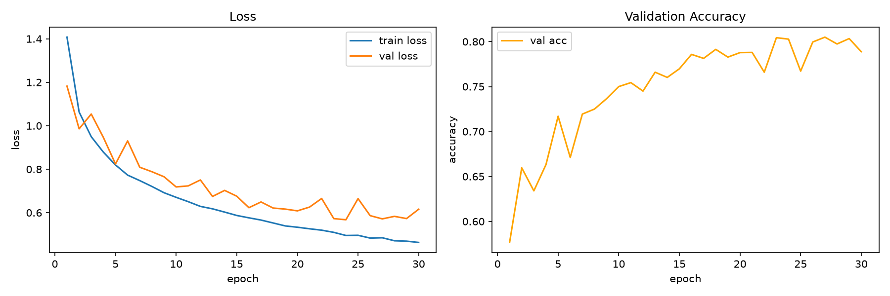
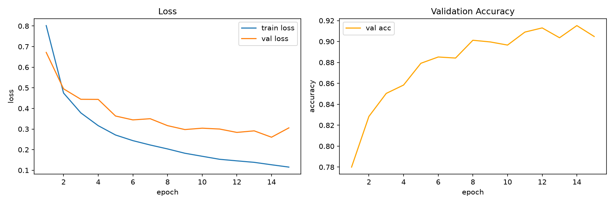
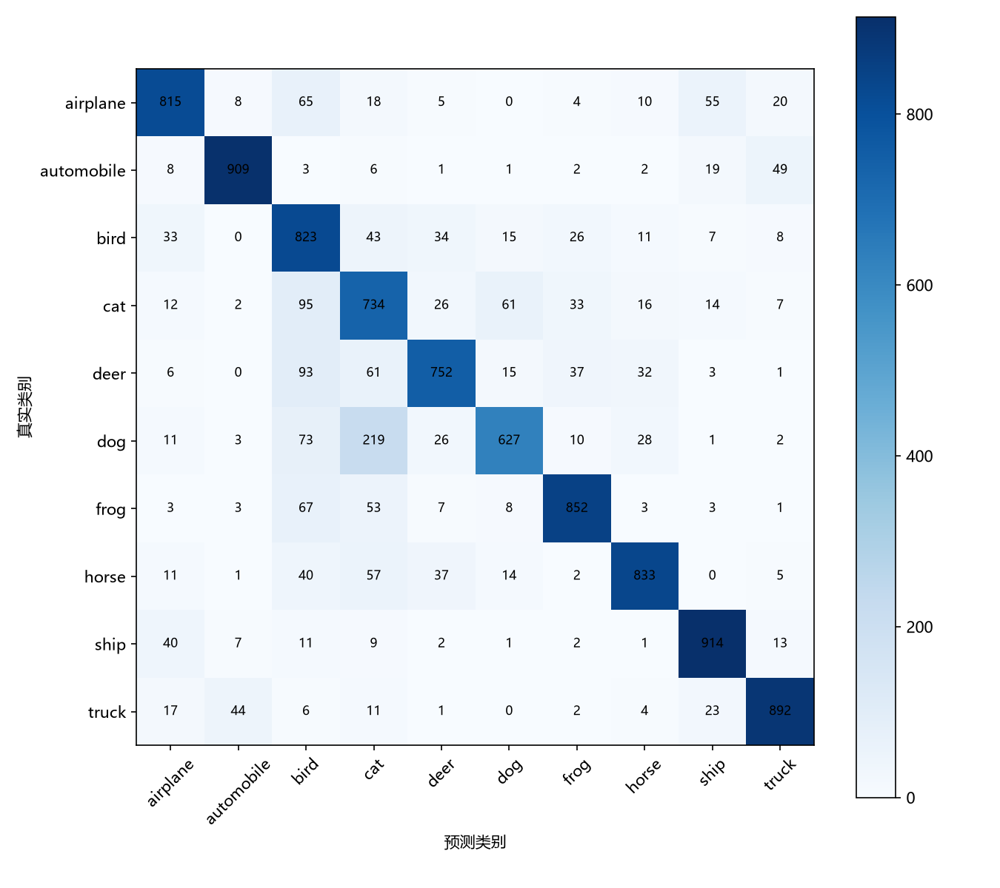
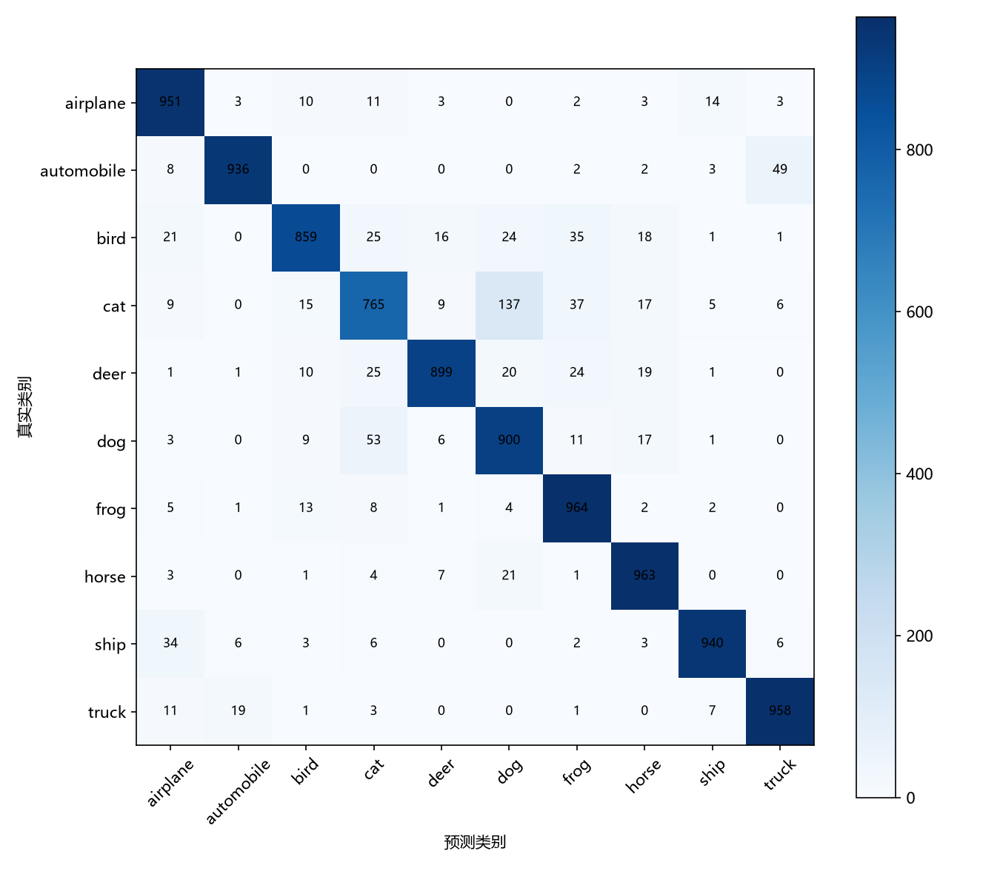

# CIFAR-10 图像分类（PyTorch）

暑期入门任务：使用 PyTorch 在 CIFAR-10 数据集上完成图像分类，分别用两种方法实验并对比：

1. **方法一**：从零实现一个简单的卷积神经网络（CNN）；
2. **方法二**：使用 ImageNet 预训练的 ResNet18 做迁移学习（微调）。

## 环境

- Python 3.11（建议使用 conda 环境 `cifar`）
- PyTorch 2.7.0（CUDA 12.8）+ torchvision 0.22.0

```bash
conda activate cifar
pip install -r requirements.txt
```

> Windows 上 pip 默认安装的是 CPU 版 PyTorch，如需 CUDA 版本请用官方源安装。
> RTX 50 系列显卡（Blackwell）必须使用 CUDA 12.8+ 的版本：
>
> ```bash
> pip install torch==2.7.0 torchvision==0.22.0 --index-url https://download.pytorch.org/whl/cu128
> ```

## 项目结构

```
CIFAR10-Classification/
├── train.py      # 模型训练
├── test.py       # 模型测试
├── model.py      # 模型定义（CNN / ResNet18）
├── dataset.py    # 数据加载与预处理
├── utils.py      # 工具函数（checkpoint、指标、绘图等）
├── data/         # CIFAR-10 数据（自动下载，不入库）
├── logs/
│   └── tensorboard/  # TensorBoard 日志
├── checkpoints/      # 模型权重
├── requirements.txt
└── README.md
```

## 使用方式

先验证数据加载是否正常（第一次运行会自动下载 CIFAR-10 到 `data/`）：

```bash
python dataset.py
```

训练（`--model` 可选 `cnn` 或 `resnet`）：

```bash
python train.py --model cnn --epochs 30 --batch_size 128
python train.py --model resnet --epochs 15 --batch_size 64
```

测试：

```bash
python test.py --model cnn
python test.py --model resnet
```

查看 TensorBoard 训练曲线：

```bash
tensorboard --logdir logs/tensorboard
```

## 数据说明

- CIFAR-10：10 个类别，共 60000 张 32×32 彩色图片（训练集 50000 张、测试集 10000 张）。
- 训练集预处理：随机水平翻转、四周填充 4 像素后随机裁剪 32×32、转张量、按官方均值/标准差标准化。
- 测试集预处理：仅转张量与标准化，不做数据增强。

## 实验记录

两套实验均已在 NVIDIA RTX 5060（CUDA 12.8，PyTorch 2.7.0）上完成，
统一设置：batch_size=128、优化器 Adam、学习率 lr=1e-3、损失函数 CrossEntropyLoss。

| 指标 | 方法一 SimpleCNN | 方法二 ResNet18 |
| --- | --- | --- |
| 训练轮数 | 30 | 15 |
| 验证集最高准确率 | 80.50% | 91.52% |
| 测试集准确率 | 81.51% | 91.35% |
| 测试集损失 | 0.5332 | 0.2786 |
| 宏平均 F1 | 0.8168 | 0.9132 |

训练/验证损失与准确率曲线：





测试集混淆矩阵：





**对比结论**：ResNet18 迁移学习比从零训练的 CNN 高约 9.8 个百分点，且只用了
一半的训练轮数。原因是预训练权重已经在 ImageNet 上学到了边缘、纹理、形状等
通用视觉特征，迁移到 CIFAR-10 后只需少量微调；而 CNN 所有参数都从随机初始化
开始学习，收敛慢、最终精度低。这说明在数据量有限的任务中，迁移学习优势明显。

详细实验过程与分析见 [实验报告_CIFAR10图像分类.pdf](实验报告_CIFAR10图像分类.pdf)
（Word 版：实验报告_CIFAR10图像分类.docx）。
