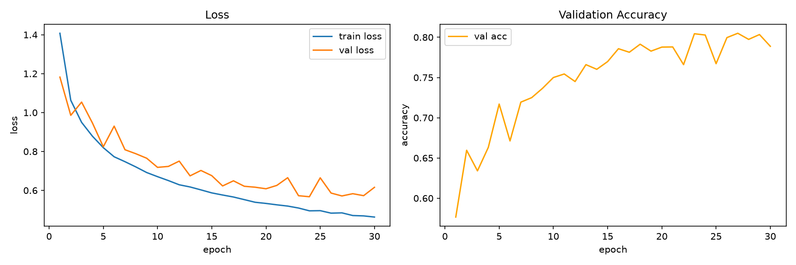
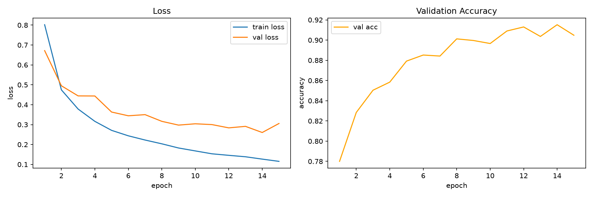
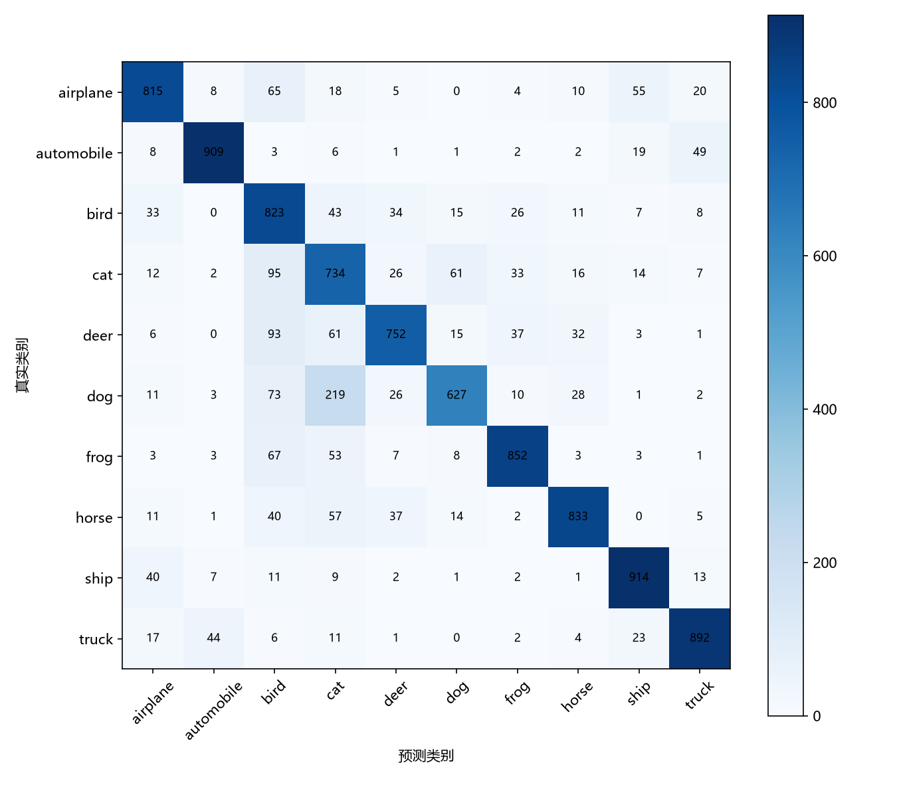
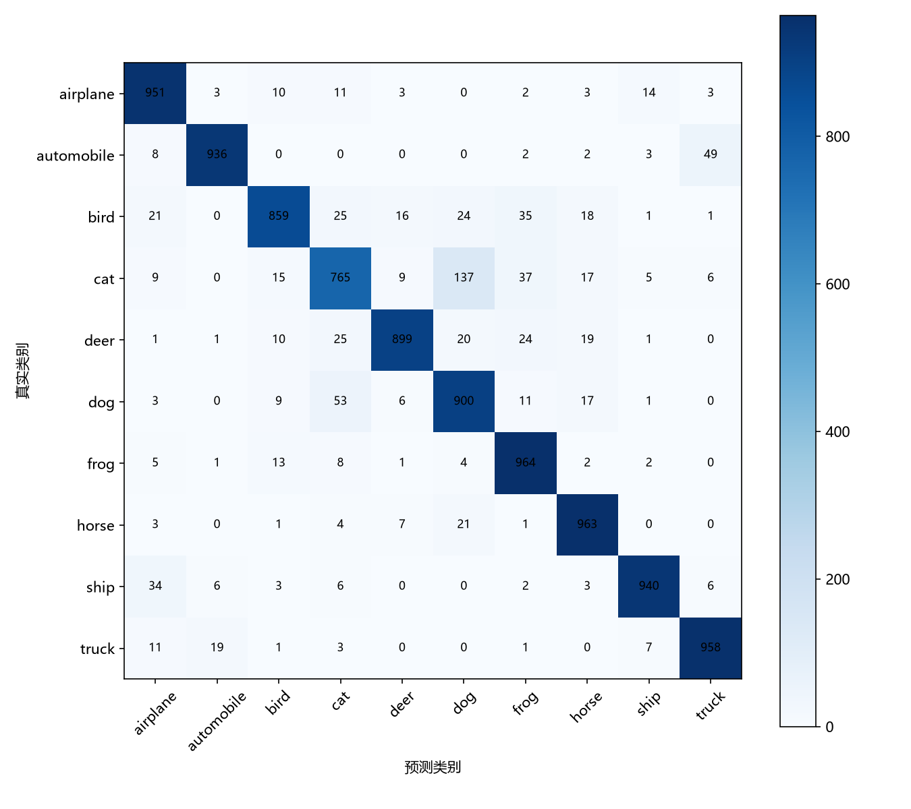
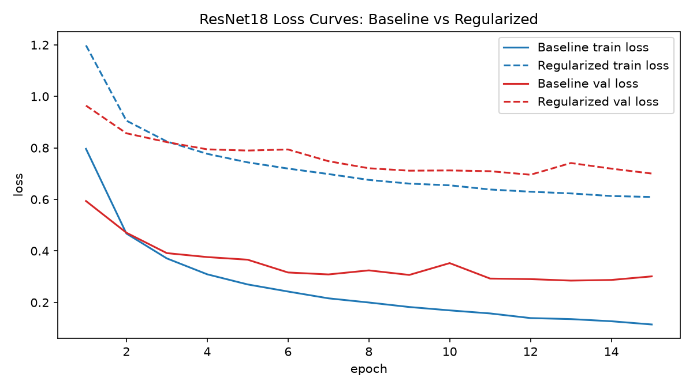
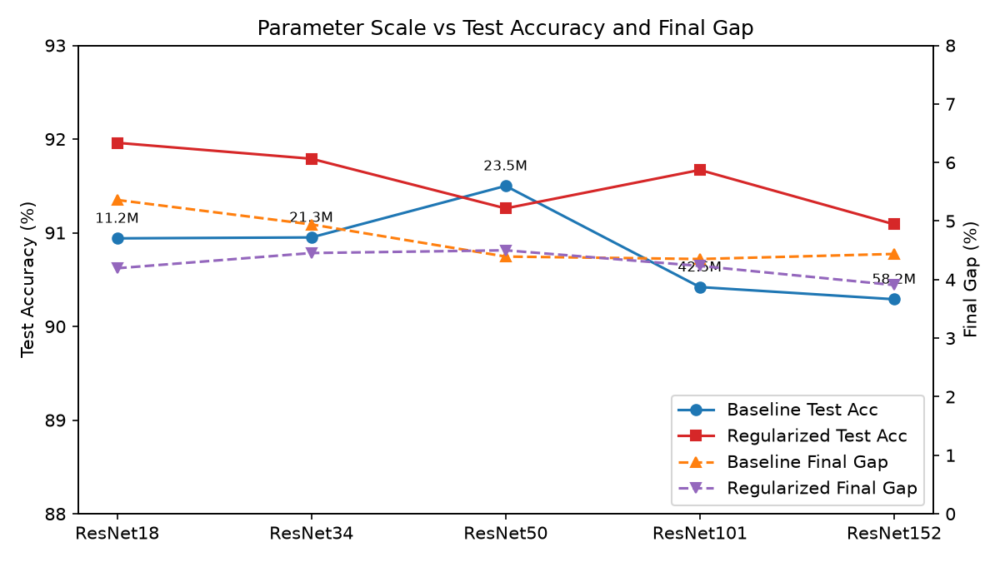
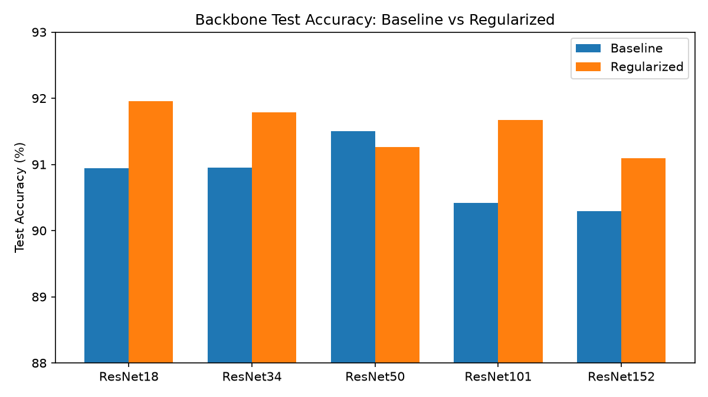

# CIFAR-10 图像分类（PyTorch）

暑期入门任务：使用 PyTorch 在 CIFAR-10 数据集上完成图像分类，分别用两种方法实验并对比：

1. **方法一**：从零实现一个简单的卷积神经网络（CNN）；
2. **方法二**：使用 ImageNet 预训练的 ResNet18 做迁移学习（微调）。

## 环境

- Python 3.11（建议使用 conda 环境 `cifar`）
- PyTorch 2.7.0（CUDA 12.8）+ torchvision 0.22.0

```bash
conda activate cifar
pip install -r requirements.txt
```

> Windows 上 pip 默认安装的是 CPU 版 PyTorch，如需 CUDA 版本请用官方源安装。
> RTX 50 系列显卡（Blackwell）必须使用 CUDA 12.8+ 的版本：
>
> ```bash
> pip install torch==2.7.0 torchvision==0.22.0 --index-url https://download.pytorch.org/whl/cu128
> ```

## 项目结构

```
CIFAR10-Classification/
├── train.py      # 模型训练
├── test.py       # 模型测试
├── model.py      # 模型定义（CNN / ResNet18）
├── dataset.py    # 数据加载与预处理
├── utils.py      # 工具函数（checkpoint、指标、绘图等）
├── data/         # CIFAR-10 数据（自动下载，不入库）
├── logs/
│   └── tensorboard/  # TensorBoard 日志
├── checkpoints/      # 模型权重
├── requirements.txt
└── README.md
```

## 使用方式

先验证数据加载是否正常（第一次运行会自动下载 CIFAR-10 到 `data/`）：

```bash
python dataset.py
```

训练（`--model` 可选 `cnn` 或 `resnet`）：

```bash
python train.py --model cnn --epochs 30 --batch_size 128
python train.py --model resnet --epochs 15 --batch_size 64
```

测试：

```bash
python test.py --model cnn
python test.py --model resnet
```

查看 TensorBoard 训练曲线：

```bash
tensorboard --logdir logs/tensorboard
```

## 数据说明

- CIFAR-10：10 个类别，共 60000 张 32×32 彩色图片（训练集 50000 张、测试集 10000 张）。
- 训练集预处理：随机水平翻转、四周填充 4 像素后随机裁剪 32×32、转张量、按官方均值/标准差标准化。
- 测试集预处理：仅转张量与标准化，不做数据增强。

## 实验记录

两套实验均已在 NVIDIA RTX 5060（CUDA 12.8，PyTorch 2.7.0）上完成，
统一设置：batch_size=128、优化器 Adam、学习率 lr=1e-3、损失函数 CrossEntropyLoss。

| 指标 | 方法一 SimpleCNN | 方法二 ResNet18 |
| --- | --- | --- |
| 训练轮数 | 30 | 15 |
| 验证集最高准确率 | 80.82% | 91.52% |
| 测试集准确率 | 81.56% | 91.35% |
| 测试集损失 | 0.5608 | 0.2786 |
| 宏平均 F1 | 0.8143 | 0.9132 |

训练/验证损失与准确率曲线：





测试集混淆矩阵：





**对比结论**：ResNet18 迁移学习比从零训练的 CNN 高约 9.8 个百分点，且只用了
一半的训练轮数。原因是预训练权重已经在 ImageNet 上学到了边缘、纹理、形状等
通用视觉特征，迁移到 CIFAR-10 后只需少量微调；而 CNN 所有参数都从随机初始化
开始学习，收敛慢、最终精度低。这说明在数据量有限的任务中，迁移学习优势明显。

详细实验过程与分析见 [实验报告_CIFAR10图像分类.pdf](实验报告_CIFAR10图像分类.pdf)
（Word 版：实验报告_CIFAR10图像分类.docx）。

## 补充实验：正则化与骨干网络对比

在原始实验基础上，进一步围绕两个问题做验证：

1. 如何用正则化缩小训练集与验证集之间的泛化差距；
2. 在相同训练设置下，参数量越大结果是否一定越好。

### 正则化实验

正则化实验以 ResNet18 为主，比较以下方法：

- Weight decay（`--weight_decay 5e-4`）
- Dropout（`--dropout 0.2`）
- Label smoothing（`--label_smoothing 0.1`）
- Cutout / RandomErasing（`--use_cutout`）
- 组合正则化：`weight_decay=5e-4 + dropout=0.2 + label_smoothing=0.1`

主要结果：

| 模型与方法 | 最好验证 acc | 测试 acc | 最终 gap |
| --- | ---: | ---: | ---: |
| ResNet18 Baseline | 91.32% | 90.94% | 5.36% |
| ResNet18 + 组合正则化 | 91.98% | 91.96% | 4.19% |
| SimpleCNN Baseline | 80.42% | 81.45% | 4.43% |
| SimpleCNN + 组合正则化 | 80.92% | 82.25% | 2.26% |

正则化前后 ResNet18 的 loss 曲线对比：



### ResNet 骨干网络对比

在相同设置下比较 ResNet18/34/50/101/152，统一训练 15 轮、lr=1e-3、
等效 batch size=128。为降低显存压力，采用 batch_size=64、梯度累积 2 步，
并启用 AMP 混合精度。

无正则化结果：

| 骨干网络 | 参数量 | 测试 acc | 最终 gap |
| --- | ---: | ---: | ---: |
| ResNet18 | 11.17M | 90.94% | 5.36% |
| ResNet34 | 21.28M | 90.95% | 4.94% |
| ResNet50 | 23.52M | 91.50% | 4.39% |
| ResNet101 | 42.51M | 90.42% | 4.35% |
| ResNet152 | 58.16M | 90.29% | 4.44% |

最佳正则化组合下结果：

| 骨干网络 | 参数量 | 测试 acc | 最终 gap |
| --- | ---: | ---: | ---: |
| ResNet18 | 11.17M | 91.96% | 4.19% |
| ResNet34 | 21.28M | 91.79% | 4.45% |
| ResNet50 | 23.52M | 91.26% | 4.50% |
| ResNet101 | 42.51M | 91.67% | 4.23% |
| ResNet152 | 58.16M | 91.09% | 3.91% |

参数量、测试准确率与最终 gap 的关系：



各骨干网络测试准确率对比：



结论：正则化能有效缩小泛化差距；参数量越大不一定带来更好的泛化结果。
在 CIFAR-10 上，ResNet50 的无正则化测试准确率最高，更深的 ResNet101/152
因过拟合和固定轮数下微调不充分反而下降。
